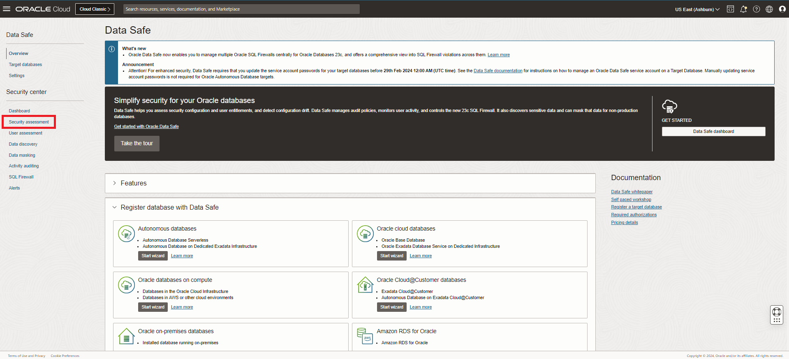
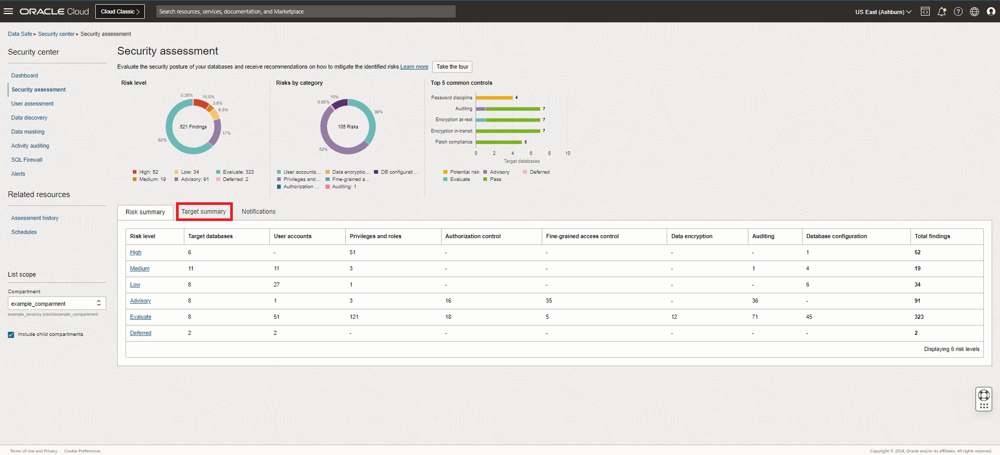
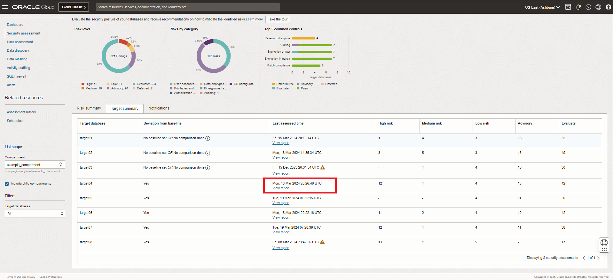
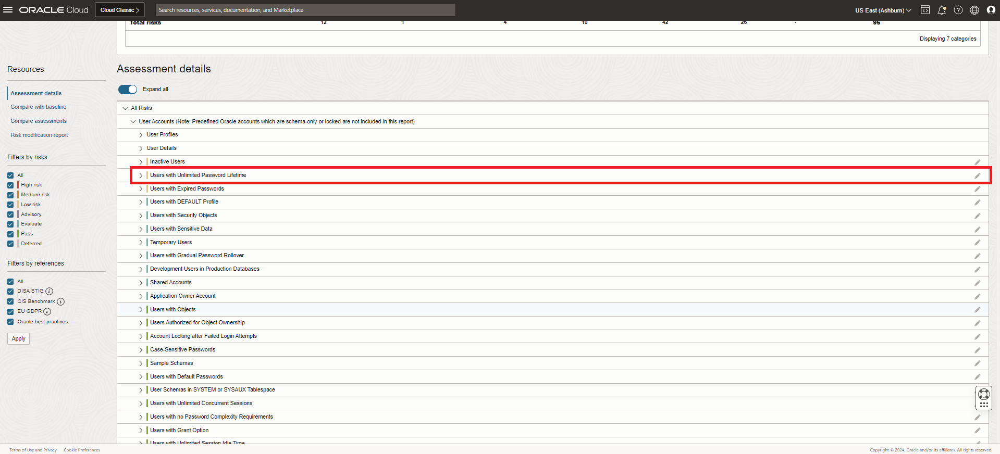
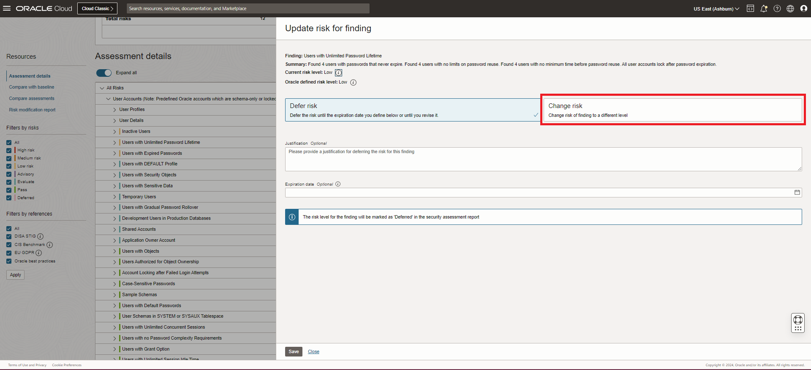
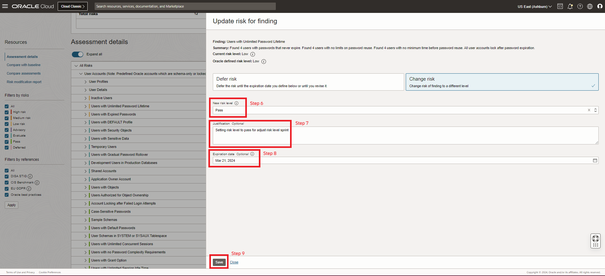

# How do I adjust the risk level of a risk finding?

Duration: 2 minutes

After completing a security assessment in Data Safe you will be presented with a number of risk findings and their initial risk levels. Once you have taken appropriate actions to mitigate security risks on a target database based on the results of a security assessment, you can adjust the risk level of a finding. Adjustments of risk levels can be indefinite or have an expiration date.

1. Under **Security center**, click **Security assessment**.

2. From the **Security assessment** page, click the **Target summary** tab.

3. On the **Target summary** tab, locate the line in the table for your target database, and click **View Report**.
    The **Security assessment details** page is displayed, showing you the latest assessment report for your target database.

4. In the **Assessment details** section, click on the pencil icon for the risk finding that you would like to adjust.

5. Select to either **Defer risk** or **Change risk**.

6. If you're changing the risk, select a **New risk level**.

7. Provide a justification for why you're adjusting the risk level of the selected finding.

8. Optionally, set an **Expiration date**.

9. Click **Save**.
    Once the risk level finishes updating you will see an indicator that the risk level for this finding has been modified.

## Learn More

* [Adjust the Risk Level of a Risk Finding](https://www.oracle.com/pls/topic/lookup?ctx=en/cloud/paas/data-safe&id=UDSCS-GUID-E5B36558-B3EE-4335-B0D9-E9EBBC785E51)

## Acknowledgements

* **Author** - Anna Haikl, User Assistance Developer, Database Development
* **Last Updated By/Date** - Anna Haikl,  March 2024
