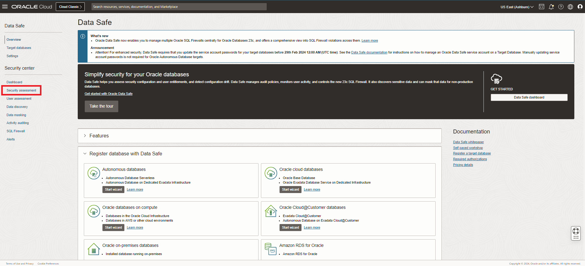
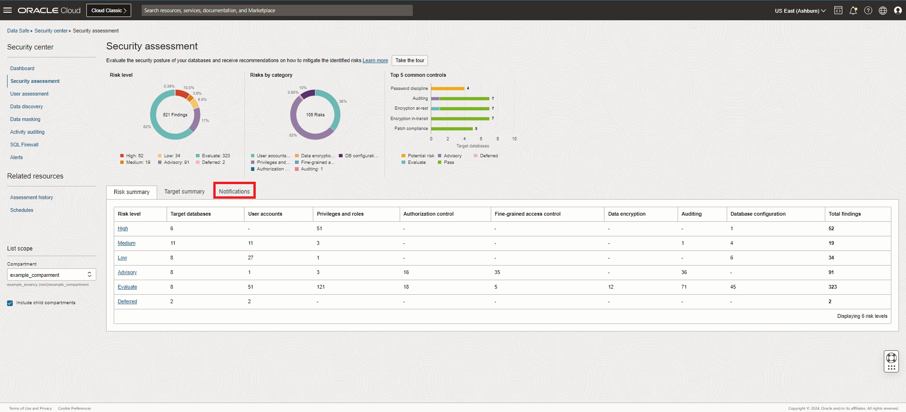
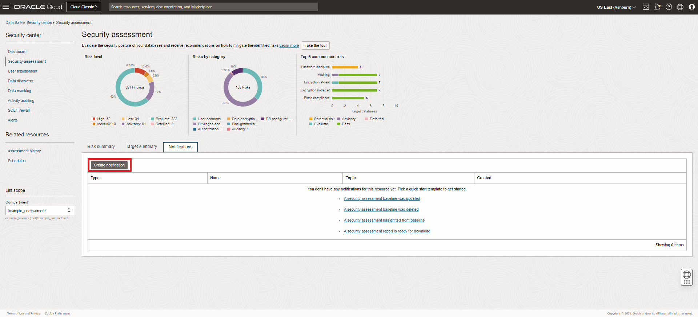
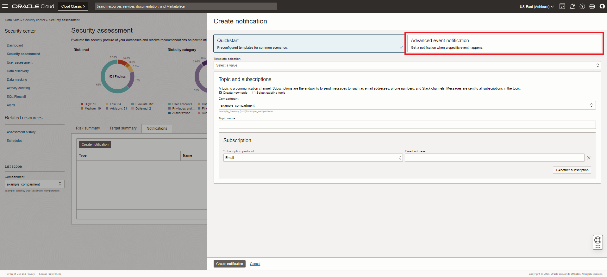
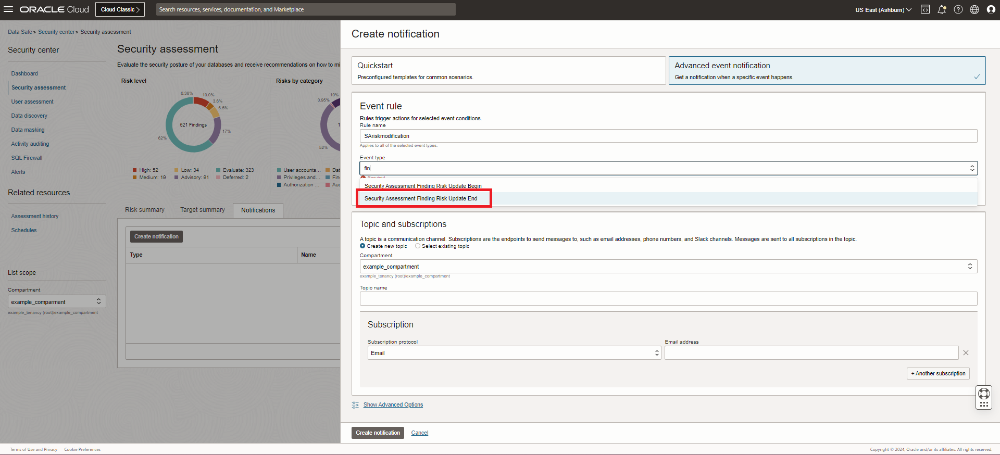
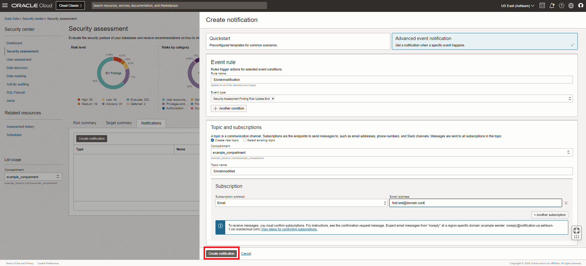

# How do I create event notifications in Oracle Data Safe?

Duration: 7 minutes

Instead of having to use OCI Events and Notifications to create Data Safe related Rules and Subscriptions, you can now use the Notifications tab available in Data Safe's features to create event notifications and subscriptions while remaining in Data Safe. For this lab we will create event notifications for modifying a risk finding in Security Assessment, but the process for creating event notifications is similar for any Data Safe feature.

## Create an event notification

1. Ensure you have the following permissions in order to access notification topics:

    ```text
    <copy>
    allow group {user-group} to manage ons-topic in compartment {compartment-name}
    </copy>
    ```

2. Ensure you have the following permissions in order to access event rules:

    ```text
    <copy>
    allow group {user-group} to manage cloudevents-rules in compartment {compartment-name}
    </copy>
    ```

3. Under **Security center**, click **Security assessment**.


4. Click the **Notifications** tab.


5. Click **Create notification**.
    The **Create notification** side panel will appear.


6. Click **Advanced event notification**.


7. Type in a **Rule name** such as *SA_risk_modification*.

8. For the **Event type**, select **Security Assessment Finding Risk Update End**.
    >**Note:** The Rule and Event are created in the compartment that you were working in when you started the Notification workflow. Rules and Events will only trigger for the compartment and any child-compartments of the compartment that they were created in.


9. In the **Topic and subscriptions** section, select a **Compartment**.
    >**Note:** This compartment is where the topic will be created, not where the rule and event will be monitored in.

10. Type in a **Topic name**, such as *SA_risk_modified*.

11. Enter in your email address to receive an email notification when a risk finding has been modified.

12. Click **Create notification**.


13. You will receive an email saying that you have chosen to subscribe to the topic. Click the link provided in the email to confirm your subscription.

You have now successfully created an event notification for the modification of a Security Assessment risk finding.

## Receive an event notification

To confirm that you have created the event notification for the modification of a Security Assessment risk finding correctly, you should adjust the risk level of a risk finding. Following the completion of the [How do I adjust the risk level of a risk finding?](include:configure-risk) sprint, you should receive an email notification that the Security Assessment Finding Risk Update End event has occurred.

## Learn More

* [Permissions to Use Contextual Event Notifications](https://www.oracle.com/pls/topic/lookup?ctx=en/cloud/paas/data-safe&id=ADMDS-GUID-44143439-1BF8-4A36-B05F-4BEAF1741C7C)
* [Creating Event Notifications in Data Safe](https://www.oracle.com/pls/topic/lookup?ctx=en/cloud/paas/data-safe&id=ADMDS-GUID-2D8D6972-13D9-467B-9FAC-50BFEF540C1C)
* [Create and Modify Event Notifications in Security Assessment](https://www.oracle.com/pls/topic/lookup?ctx=en/cloud/paas/data-safe&id=UDSCS-GUID-112FB4B7-58AE-46DE-B6DB-11F24EAD5D74)
* [Security Assessment Event Types](https://www.oracle.com/pls/topic/lookup?ctx=en/cloud/paas/data-safe&id=ADMDS-GUID-E5F5C679-BD96-4912-9573-4D99FF662A82)

## Acknowledgements

* **Author** - Anna Haikl, User Assistance Developer, Database Development
* **Last Updated By/Date** - Anna Haikl,  March 2024
